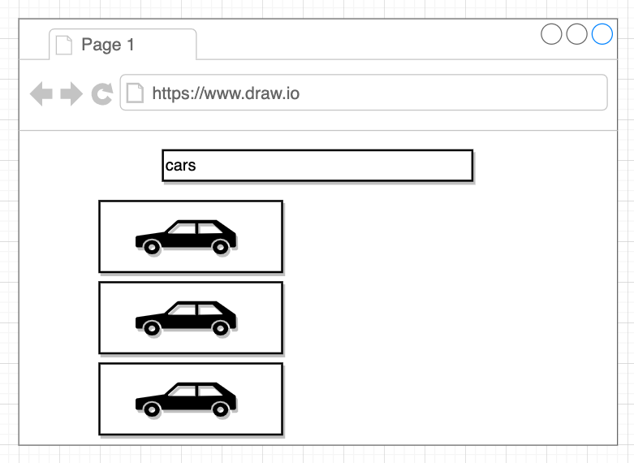

## User Stories
User stories
what we want to do is show a text input at the very top center of the screen.
A user should then be able to type in some text here. So like they go to type in cars or plant flowers or buildings any term you could possibly imagine after they type in that term and then press enter. We're going to do a search or a request to an outside API that is going to find images or basically just simple pictures that match whatever term that the user just entered. So if a user enters and cars and then presses enter I would want to somehow get a list of images of cars and show them on the screen to the user.

Not a lot of styling just kind of want to focus on
* handling user typing something in 
* handling showing a list of data 
* handling somehow searching for images.

## App Challenges
1. Need to get a search term from the user
2. Need to use that search term to make a request to an outside API and fetch data
3. Need to take the fetched images and show them on the screen in a list

## Technologies Used
* React.js
* semantic-ui
